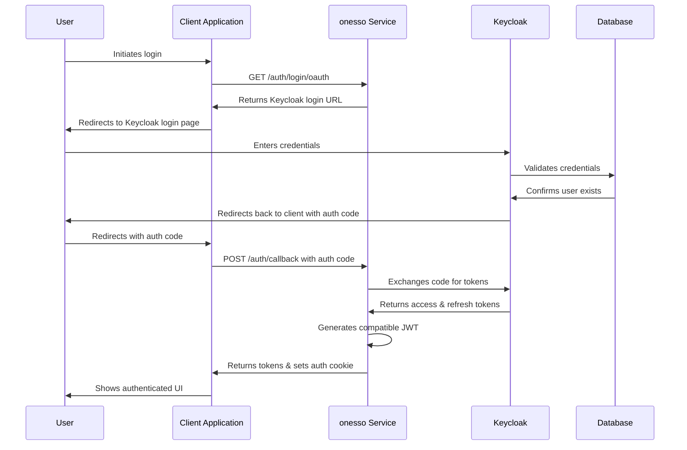
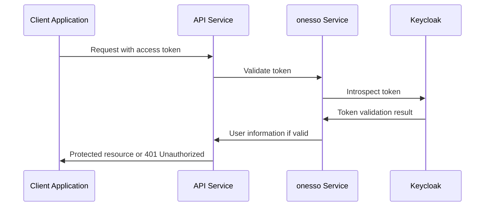
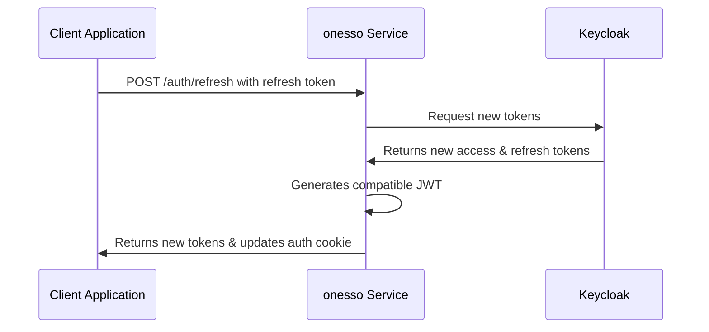
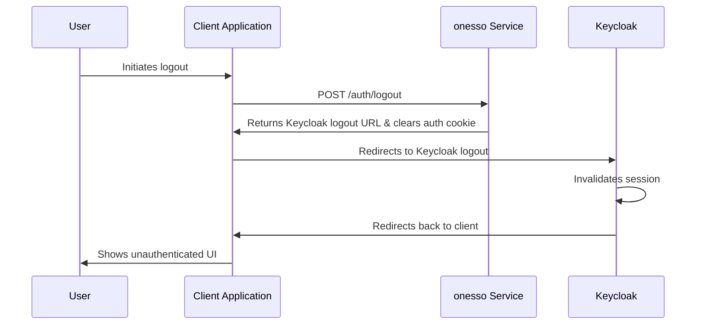
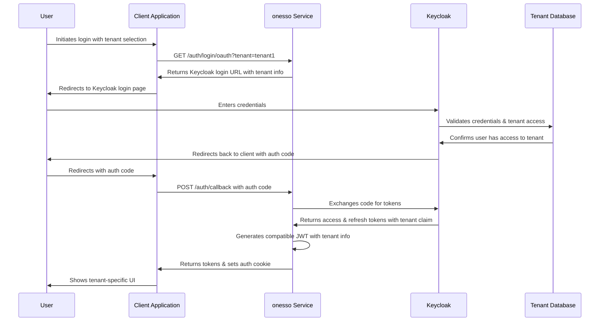

# onesso Authentication Flow Sequence Diagram

The following sequence diagram illustrates the authentication flow between the client application, onesso service, and Keycloak.

## Login Flow

## Token Validation Flow

## Token Refresh Flow

## Logout Flow

## Multi-Tenant Authentication Flow

These sequence diagrams illustrate the key authentication flows in the onesso authentication service. The service acts as a bridge between client applications and Keycloak, providing a seamless authentication experience while maintaining compatibility with existing systems.
