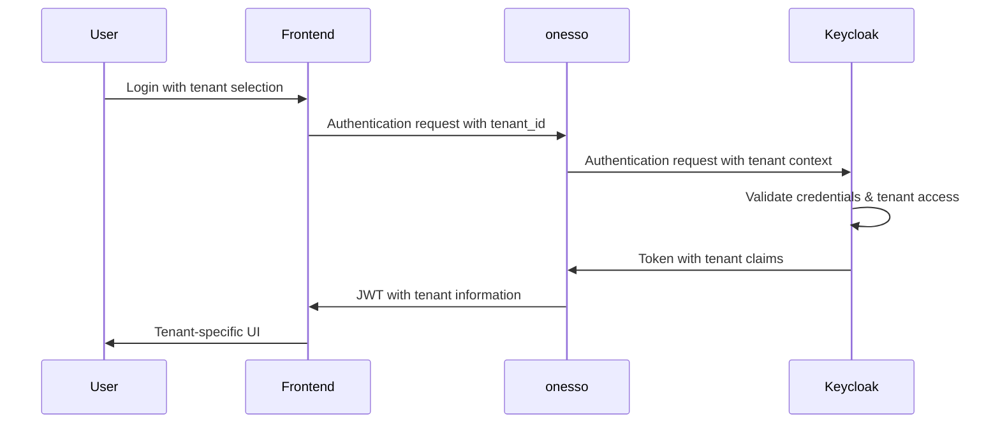

# Multi-Tenant Implementation Guide for onesso

This guide provides detailed information about the multi-tenant implementation in the onesso authentication service, including architecture, isolation mechanisms, and testing strategies.

## Table of Contents

1. [Overview](#overview)
2. [Multi-Tenant Architecture](#multi-tenant-architecture)
3. [Tenant Isolation Mechanisms](#tenant-isolation-mechanisms)
4. [Implementation Details](#implementation-details)
5. [API Endpoints](#api-endpoints)
6. [Frontend Integration](#frontend-integration)
7. [Backend Integration](#backend-integration)
8. [Testing Strategies](#testing-strategies)
9. [Security Considerations](#security-considerations)
10. [Troubleshooting](#troubleshooting)

## Overview

Multi-tenancy in onesso allows a single instance of the authentication service to serve multiple client organizations (tenants) while keeping their data and access completely isolated from each other. This is implemented using Keycloak's built-in capabilities combined with additional isolation mechanisms in the onesso service.

### Key Features

- **Tenant-Specific Authentication**: Users authenticate within their tenant context
- **Isolated User Management**: Each tenant manages its own users
- **Role-Based Access Control**: Tenant-specific roles and permissions
- **Tenant Administration**: Dedicated tenant administrators
- **Cross-Tenant Prevention**: Prevents access across tenant boundaries

## Multi-Tenant Architecture

The multi-tenant architecture in onesso follows a hybrid approach:

### Logical Isolation Model

```
┌─────────────────────────────────────────────────────────┐
│                  onesso Authentication                   │
├─────────────┬─────────────┬─────────────┬─────────────┐
│  Tenant A   │  Tenant B   │  Tenant C   │  Tenant D   │
├─────────────┼─────────────┼─────────────┼─────────────┤
│ Users       │ Users       │ Users       │ Users       │
│ Roles       │ Roles       │ Roles       │ Roles       │
│ Groups      │ Groups      │ Groups      │ Groups      │
│ Settings    │ Settings    │ Settings    │ Settings    │
└─────────────┴─────────────┴─────────────┴─────────────┘
               Shared Keycloak Infrastructure
```

### Components

1. **Keycloak Realm**: A single realm contains all tenants
2. **Tenant Attribute**: Users have a `tenant_id` attribute
3. **Tenant-Specific Roles**: Roles are prefixed with tenant ID
4. **Tenant Groups**: Groups are organized by tenant
5. **JWT Claims**: Tokens include tenant information
6. **Middleware**: API requests are filtered by tenant

## Tenant Isolation Mechanisms

onesso implements multiple layers of isolation to ensure tenant security:

### 1. Authentication Isolation

- Users can only authenticate within their assigned tenant
- Login flows include tenant context
- Token issuance is tenant-aware

### 2. Authorization Isolation

- JWT tokens include tenant ID claim
- Role assignments are tenant-specific
- Permission checks include tenant verification

### 3. Data Isolation

- API endpoints filter data by tenant
- Database queries include tenant conditions
- Cached data is segregated by tenant

### 4. Administrative Isolation

- Tenant administrators can only manage their own tenant
- Super administrators can manage all tenants
- Administrative actions are logged with tenant context

## Implementation Details

### Tenant Identification

Tenants are identified by a unique string ID, which is:

1. Included in the authentication flow
2. Stored as a user attribute
3. Added to JWT tokens as a claim
4. Used in API authorization checks

### User-Tenant Association

Users are associated with tenants through:

1. The `tenant_id` attribute in Keycloak
2. Tenant-specific role assignments
3. Membership in tenant groups

### Multi-Tenant Token Flow



### Code Implementation

Key classes and interfaces for multi-tenancy:

```typescript
// Tenant interface
interface Tenant {
  id: string;
  name: string;
  displayName: string;
  settings: TenantSettings;
}

// Tenant-aware user
interface TenantUser {
  id: string;
  email: string;
  tenant_id: string;
  roles: string[];
}

// Tenant guard for API protection
@Injectable()
class TenantGuard implements CanActivate {
  canActivate(context: ExecutionContext): boolean {
    const request = context.switchToHttp().getRequest();
    const user = request.user;
    const tenantId = request.params.tenantId;
    
    // Verify user has access to the requested tenant
    return user.tenant_id === tenantId || this.isSuperAdmin(user);
  }
}
```

## API Endpoints

The onesso service provides the following multi-tenant endpoints:

### Tenant Management

- `GET /api/tenants`: List all tenants (super admin only)
- `POST /api/tenants`: Create a new tenant
- `GET /api/tenants/:id`: Get tenant details
- `PUT /api/tenants/:id`: Update tenant
- `DELETE /api/tenants/:id`: Delete tenant

### Tenant User Management

- `GET /api/tenants/:id/users`: List users in tenant
- `POST /api/tenants/:id/users`: Add user to tenant
- `DELETE /api/tenants/:id/users/:userId`: Remove user from tenant
- `PUT /api/tenants/:id/users/:userId/roles`: Update user roles in tenant

### Tenant-Aware Authentication

- `POST /api/auth/login?tenant_id=:id`: Login to specific tenant
- `GET /api/auth/me`: Get current user with tenant information

## Frontend Integration

### NextAuth.js Integration

```typescript
// Add tenant_id to the authentication request
const login = (tenantId: string, redirectUrl?: string) => {
  signIn('onesso', { 
    callbackUrl: redirectUrl || '/',
    tenant_id: tenantId
  });
};

// Check tenant access in components
const hasTenantAccess = (tenantId: string) => {
  if (!user) return false;
  return user.tenant_id === tenantId || hasRole('super_admin');
};
```

### Tenant Selection UI

Implement a tenant selection screen for users with access to multiple tenants:

```tsx
function TenantSelector({ onSelect }) {
  const { user } = useAuth();
  const [tenants, setTenants] = useState([]);
  
  useEffect(() => {
    // Fetch tenants the user has access to
    fetchUserTenants().then(setTenants);
  }, [user]);
  
  return (
    <div>
      <h2>Select a Tenant</h2>
      <ul>
        {tenants.map(tenant => (
          <li key={tenant.id}>
            <button onClick={() => onSelect(tenant.id)}>
              {tenant.displayName}
            </button>
          </li>
        ))}
      </ul>
    </div>
  );
}
```

## Backend Integration

### NestJS Integration

```typescript
// Tenant module
@Module({
  imports: [
    CommonModule,
    KeycloakModule,
  ],
  controllers: [TenantsController],
  providers: [
    TenantsService,
    TenantGuard,
  ],
  exports: [TenantsService],
})
export class TenantsModule {}

// Tenant-aware controller
@Controller('api/tenants/:tenantId/resources')
@UseGuards(JwtAuthGuard, TenantGuard)
export class ResourcesController {
  @Get()
  findAll(@Param('tenantId') tenantId: string, @Request() req) {
    // User is guaranteed to have access to this tenant
    return this.resourcesService.findAllByTenant(tenantId);
  }
}
```

### Middleware for Tenant Isolation

```typescript
@Injectable()
export class TenantMiddleware implements NestMiddleware {
  use(req: Request, res: Response, next: NextFunction) {
    const user = req.user;
    const requestedTenantId = req.params.tenantId;
    
    if (!user) {
      throw new UnauthorizedException('Authentication required');
    }
    
    if (requestedTenantId && user.tenant_id !== requestedTenantId && !this.isSuperAdmin(user)) {
      throw new ForbiddenException('Access to this tenant is not allowed');
    }
    
    next();
  }
}
```

## Testing Strategies

### Unit Testing

Test individual components with tenant isolation:

```typescript
describe('TenantsService', () => {
  it('should create a tenant', async () => {
    const result = await service.createTenant({
      name: 'test-tenant',
      displayName: 'Test Tenant',
    });
    
    expect(result.name).toBe('test-tenant');
  });
  
  it('should prevent access across tenants', async () => {
    const user = { id: '1', tenant_id: 'tenant-a' };
    
    await expect(
      service.getTenantDetails('tenant-b', user)
    ).rejects.toThrow(ForbiddenException);
  });
});
```

### Integration Testing

Test the complete multi-tenant flow:

```typescript
describe('Multi-tenant Authentication', () => {
  it('should authenticate user in correct tenant', async () => {
    // Create test tenants
    const tenantA = await createTestTenant('tenant-a');
    const tenantB = await createTestTenant('tenant-b');
    
    // Create users in each tenant
    const userA = await createTestUser({ email: 'user-a@example.com', tenant_id: tenantA.id });
    const userB = await createTestUser({ email: 'user-b@example.com', tenant_id: tenantB.id });
    
    // Test authentication in tenant A
    const resultA = await request(app.getHttpServer())
      .post('/api/auth/login')
      .send({ email: 'user-a@example.com', password: 'password', tenant_id: tenantA.id })
      .expect(201);
      
    expect(resultA.body.login).toBe(true);
    
    // Verify token contains correct tenant
    const decodedToken = jwt.decode(resultA.body.accessToken);
    expect(decodedToken.tenant_id).toBe(tenantA.id);
    
    // Test cross-tenant access prevention
    await request(app.getHttpServer())
      .get(`/api/tenants/${tenantB.id}/users`)
      .set('Authorization', `Bearer ${resultA.body.accessToken}`)
      .expect(403);
  });
});
```

### End-to-End Testing

Test the complete system with real tenants:

1. Create test tenants in Keycloak
2. Register test users in each tenant
3. Test authentication flows with tenant context
4. Verify tenant isolation in API calls
5. Test tenant administration functions
6. Verify tenant data isolation

## Security Considerations

### Preventing Tenant Enumeration

To prevent tenant enumeration attacks:

1. Do not expose tenant IDs in error messages
2. Use rate limiting on tenant-related endpoints
3. Implement proper logging for failed tenant access attempts
4. Consider using tenant-specific subdomains for additional isolation

### Cross-Tenant Access Prevention

Implement multiple layers of protection:

1. Token validation with tenant verification
2. Database queries with tenant filters
3. API guards for tenant access control
4. Logging and monitoring for suspicious cross-tenant access attempts

### Tenant Data Segregation

Ensure complete data isolation:

1. Include tenant filters in all database queries
2. Implement tenant context in caching mechanisms
3. Verify tenant access in all API endpoints
4. Use tenant-specific encryption keys for sensitive data

## Troubleshooting

### Common Issues

1. **Cross-Tenant Access Errors**:
   - Verify the user's tenant_id attribute in Keycloak
   - Check token claims for proper tenant information
   - Ensure API guards are correctly implemented

2. **Missing Tenant Context**:
   - Verify tenant_id is included in authentication requests
   - Check that tenant claims are properly added to tokens
   - Ensure tenant middleware is correctly configured

3. **Tenant Creation Issues**:
   - Verify Keycloak admin permissions
   - Check for duplicate tenant names
   - Ensure proper error handling in tenant creation process

### Debugging

Enable tenant-specific logging:

```typescript
this.logger.debug(`Tenant operation: ${operation}`, {
  tenant_id: tenantId,
  user_id: userId,
  timestamp: new Date().toISOString(),
});
```

### Monitoring

Monitor tenant-specific metrics:

1. Authentication attempts per tenant
2. API usage by tenant
3. Error rates by tenant
4. Cross-tenant access attempts
5. Tenant administration actions
