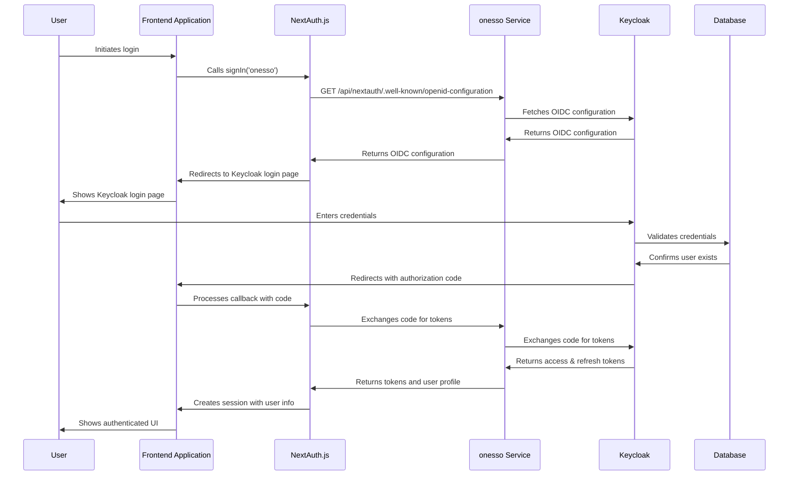
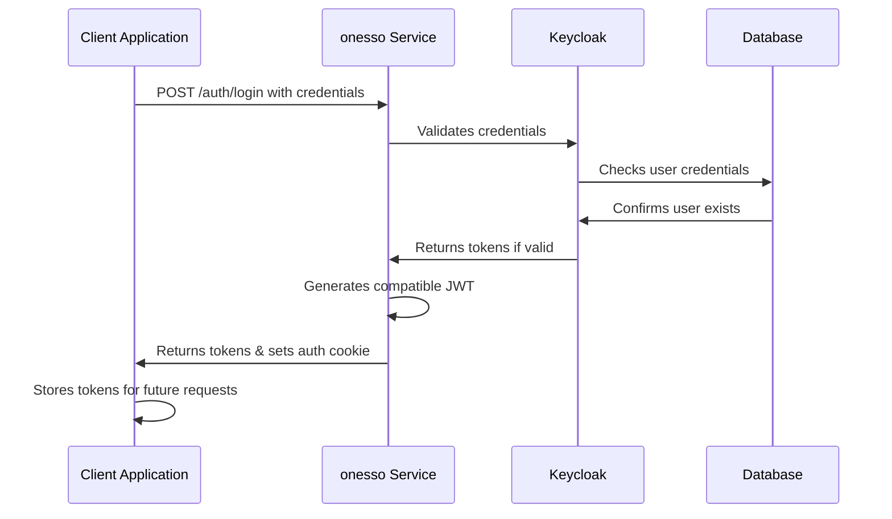
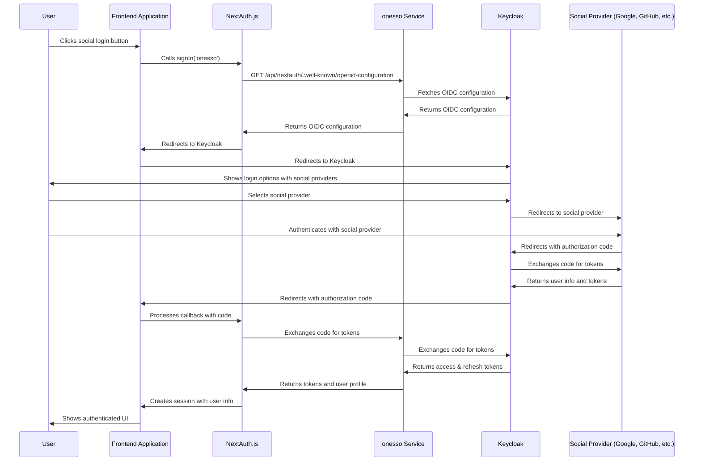
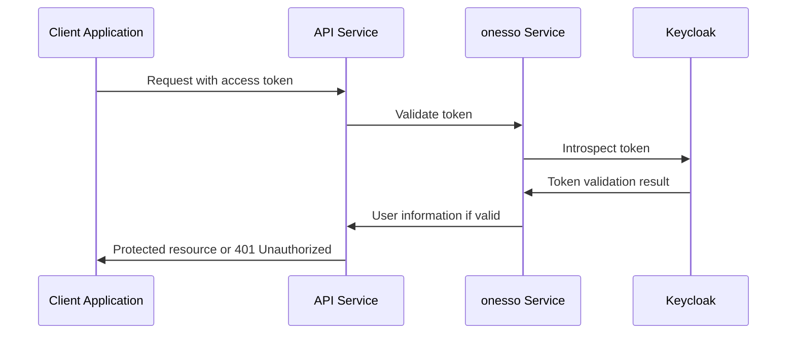
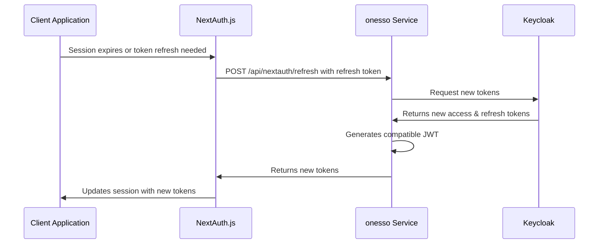
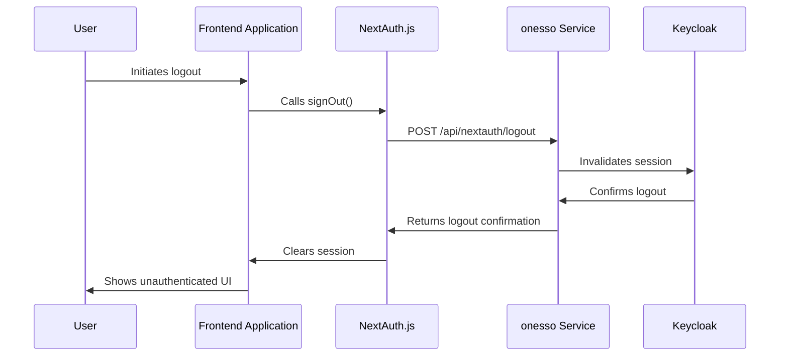
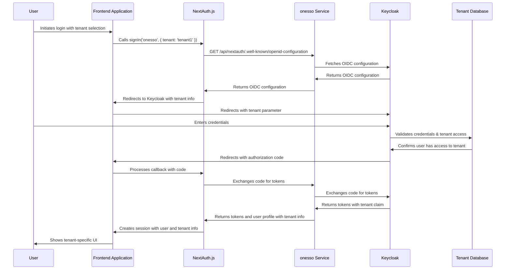
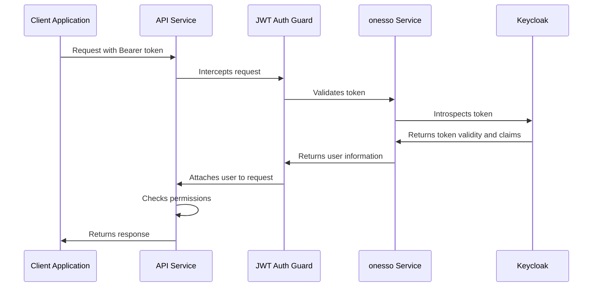
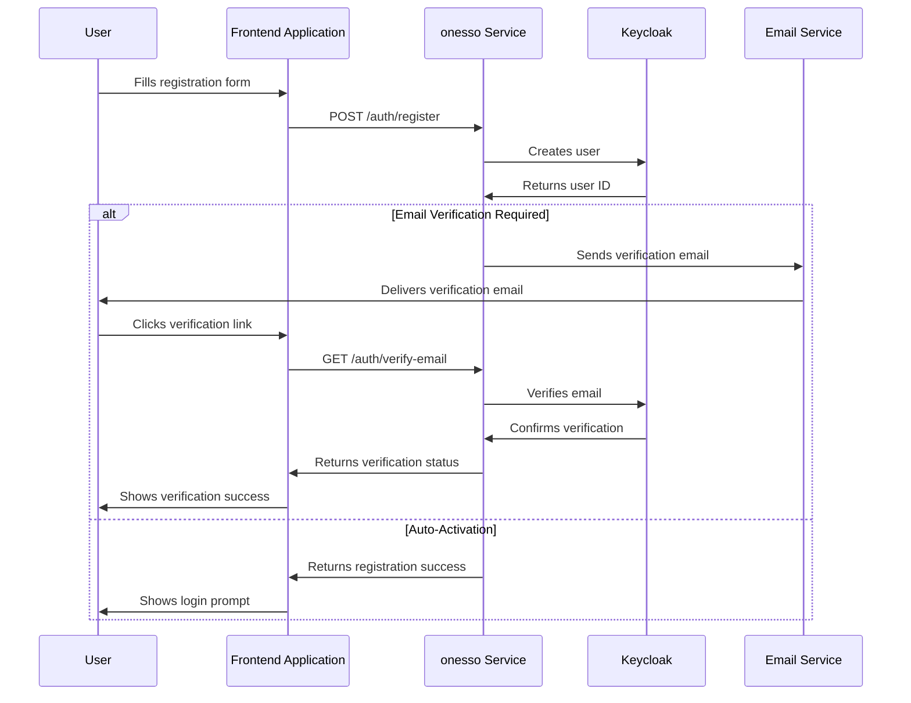
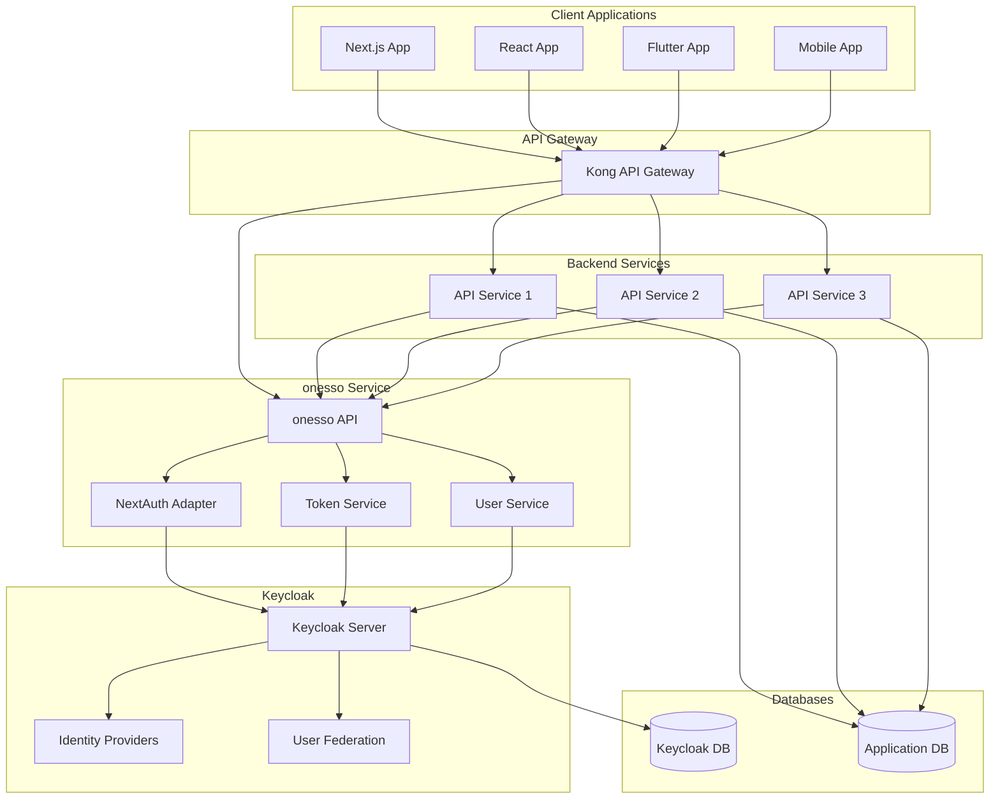

# onesso Authentication Flow Diagram

This document provides a visual representation of the authentication flows in the onesso authentication service, which is built on Keycloak and provides centralized authentication for all applications in the ecosystem.

## Overview

The onesso authentication service acts as a bridge between client applications and Keycloak, providing a seamless authentication experience while maintaining compatibility with existing systems. The service supports various authentication methods, including:

- Username/password authentication
- Social login (OAuth providers)
- Multi-factor authentication (MFA)
- API key authentication

## Authentication Flows

### Standard Login Flow

### Direct API Authentication Flow

### Social Login Flow

### Token Validation Flow

### Token Refresh Flow

### Logout Flow

### Multi-Tenant Authentication Flow

## Backend Integration Flow

## Registration Flow

## Complete System Architecture

These diagrams illustrate the key authentication flows and system architecture in the onesso authentication service. The service acts as a bridge between client applications and Keycloak, providing a seamless authentication experience while maintaining compatibility with existing systems.
