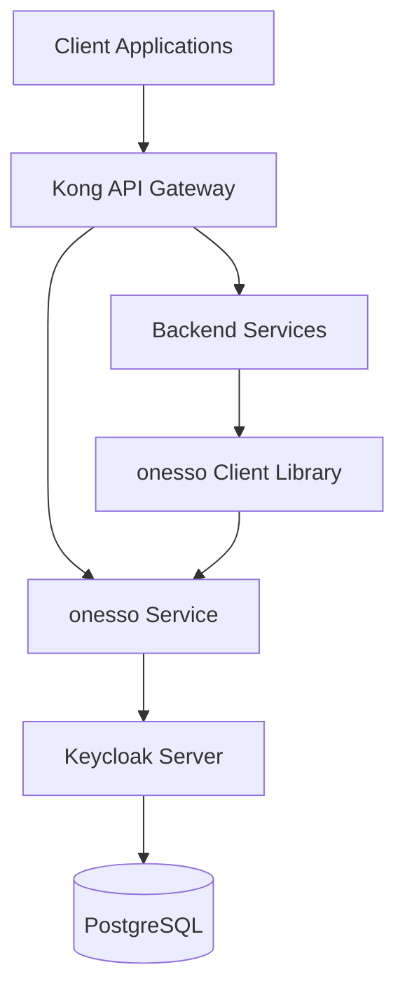

# onesso Authentication Service Implementation Plan

## Overview

This document outlines the implementation plan for the "onesso" authentication service built on Keycloak. The service will provide centralized authentication for all applications in the ecosystem, supporting multi-tenancy and various authentication methods.

## 1. Architecture

### 1.1 Components

- **Keycloak Server**: Core identity and access management
- **onesso Microservice**: NestJS service that wraps Keycloak functionality
- **API Gateway**: Kong for routing and authentication
- **Frontend Integration**: Libraries for React/Next.js and Flutter
- **Backend Integration**: Libraries for NestJS and other services

### 1.2 High-Level Architecture Diagram



## 2. Keycloak Configuration

### 2.1 Realm Setup

- Create a dedicated realm named `onesso`
- Configure realm settings:
  - Enable user registration
  - Set token lifespans (access: 15 min, refresh: 30 days)
  - Configure password policies
  - Set up email verification

### 2.2 Client Configuration

#### 2.2.1 onesso-admin Client

- **Client Type**: Confidential
- **Access Type**: Bearer-only
- **Service Accounts**: Enabled
- **Authorization**: Enabled
- **Valid Redirect URIs**: Admin dashboard URLs
- **Web Origins**: Admin dashboard origins
- **Scopes**: openid, profile, email, roles, tenant

#### 2.2.2 onesso-public Client

- **Client Type**: Public
- **Access Type**: Authorization Code Flow with PKCE
- **Valid Redirect URIs**: Frontend application URLs
- **Web Origins**: Frontend application origins
- **Scopes**: openid, profile, email, roles, tenant

### 2.3 Identity Providers

Configure the following identity providers:
- Google
- GitHub
- Facebook
- Twitter/X
- Discord
- LinkedIn
- Bluesky
- Farcaster (custom)
- Wallet (custom)

### 2.4 Multi-Tenancy Implementation

- Store tenant information as client roles or user attributes
- Create a custom protocol mapper to include tenant_id in JWT tokens
- Implement tenant isolation using Keycloak's authorization services

## 3. onesso Microservice Implementation

### 3.1 Project Structure

```
onesso/
├─ src/
│   ├─ modules/
│   │   ├─ auth/              # Authentication endpoints
│   │   ├─ tenants/           # Tenant management
│   │   ├─ users/             # User management
│   │   └─ providers/         # Custom auth providers
│   ├─ common/                # Shared utilities
│   │   ├─ decorators/        # Custom decorators
│   │   ├─ filters/           # Exception filters
│   │   ├─ guards/            # Auth guards
│   │   └─ interceptors/      # Request/response interceptors
│   ├─ config/                # Configuration
│   └─ main.ts                # Application bootstrap
├─ test/                      # Tests
├─ Dockerfile                 # Docker configuration
└─ package.json               # Dependencies
```

### 3.2 Core Endpoints

#### 3.2.1 Authentication Endpoints

- `POST /auth/login`: Initiate login flow
- `POST /auth/callback`: Handle OAuth callback
- `POST /auth/refresh`: Refresh access token
- `POST /auth/logout`: Logout user
- `GET /auth/me`: Get current user info
- `GET /auth/validate`: Validate token

#### 3.2.2 Tenant Management Endpoints

- `GET /tenants`: List tenants
- `POST /tenants`: Create tenant
- `GET /tenants/:id`: Get tenant details
- `PUT /tenants/:id`: Update tenant
- `DELETE /tenants/:id`: Delete tenant
- `POST /tenants/:id/users`: Add user to tenant
- `DELETE /tenants/:id/users/:userId`: Remove user from tenant

#### 3.2.3 User Management Endpoints

- `GET /users`: List users
- `POST /users`: Create user
- `GET /users/:id`: Get user details
- `PUT /users/:id`: Update user
- `DELETE /users/:id`: Delete user
- `PUT /users/:id/password`: Update password
- `POST /users/:id/activate`: Activate user
- `POST /users/:id/deactivate`: Deactivate user

### 3.3 Custom Authentication Providers

Implement custom authentication providers for:
- Farcaster
- Wallet authentication
- Any other provider not natively supported by Keycloak

### 3.4 Multi-Tenancy Support

- Implement tenant creation and management
- Enforce tenant isolation in all endpoints
- Provide tenant-specific configuration options

## 4. Integration with Existing Systems

### 4.1 API Gateway Integration

- Configure Kong to route authentication requests to onesso service
- Set up Kong OIDC plugin for token validation
- Configure rate limiting and security policies

### 4.2 Frontend Integration

#### 4.2.1 Next.js Integration with NextAuth.js

- Implement NextAuth.js provider for onesso
- Configure NextAuth.js with onesso OIDC endpoints
- Implement login, logout, and token refresh flows
- Handle token storage and session management
- Provide React hooks for authentication state
- Create middleware for route protection

#### 4.2.2 Flutter Integration

- Create a Flutter authentication package
- Implement OAuth flows using flutter_appauth
- Handle token storage using secure_storage
- Provide authentication state management

### 4.3 Backend Integration

- Create a NestJS module for onesso integration
- Implement JWT validation using Keycloak public keys
- Provide guards and decorators for authorization
- Handle token introspection and validation

## 5. Migration Strategy

### 5.1 User Migration

- Create a migration script to transfer users from the existing system to Keycloak
- Map existing user attributes to Keycloak user attributes
- Migrate password hashes if possible, or require password reset
- Preserve existing social provider connections

### 5.2 Phased Rollout

1. **Phase 1**: Deploy Keycloak and onesso service in parallel with existing auth
2. **Phase 2**: Migrate admin users and test thoroughly
3. **Phase 3**: Gradually migrate user segments
4. **Phase 4**: Switch all traffic to new auth system
5. **Phase 5**: Decommission old auth system

## 6. Security Considerations

- Implement proper HTTPS configuration
- Set secure cookie policies
- Configure CORS properly
- Implement rate limiting and brute force protection
- Set up monitoring and alerting for security events
- Regularly update Keycloak to latest version
- Conduct security audits

## 7. Monitoring and Observability

- Set up logging for authentication events
- Configure metrics collection
- Create dashboards for auth-related metrics
- Set up alerts for suspicious activities
- Implement audit logging

## 8. Documentation

- Create API documentation
- Write integration guides for frontend and backend
- Document security best practices
- Create user migration guide
- Document troubleshooting procedures

## 9. Testing Strategy

- Unit tests for all components
- Integration tests for auth flows
- Load testing for performance
- Security testing
- User acceptance testing

## 10. Timeline and Milestones

| Milestone | Description | Estimated Time |
|-----------|-------------|----------------|
| Setup Keycloak | Install and configure Keycloak | 1 week |
| Develop onesso Service | Implement core service functionality | 2 weeks |
| Integration Libraries | Create libraries for frontend and backend | 1 week |
| User Migration | Develop and test migration scripts | 1 week |
| Testing | Comprehensive testing of all components | 1 week |
| Documentation | Create documentation and guides | 1 week |
| Phased Rollout | Gradually deploy to production | 2 weeks |

Total estimated time: 9 weeks
